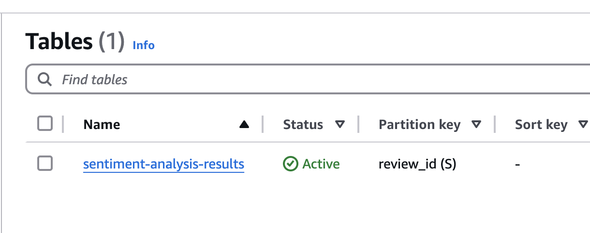
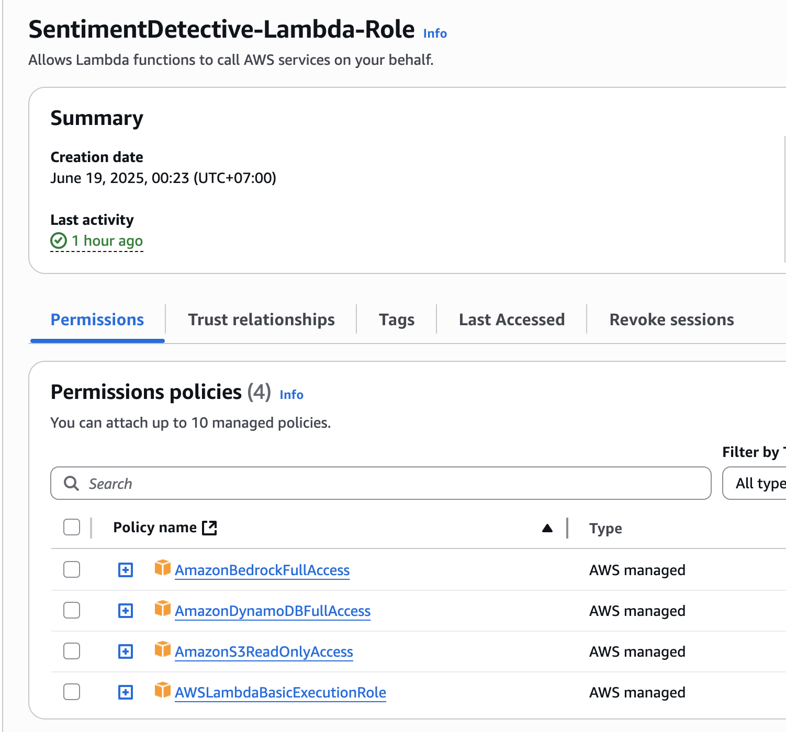
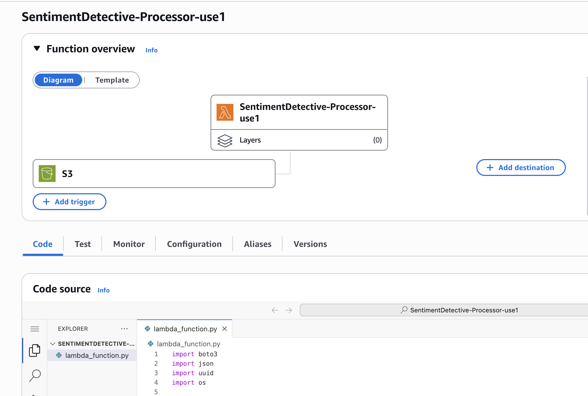
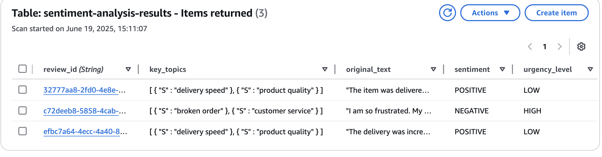

### **Project Overview: The Sentiment Detective**

**The Problem:** Businesses are flooded with text content like customer reviews, support tickets, and social media comments. Manually reading through all of it to gauge customer sentiment is slow, expensive, and inefficient.

**The Solution:** We will build a serverless pipeline that automatically ingests text files, uses an AI model to determine the sentiment, topics, and urgency, and stores this structured data for analysis.

**The Architecture:** `S3 (upload) -> Lambda (logic) -> Bedrock (AI analysis) -> DynamoDB (storage)`

---

### **Step 1: Enable Model Access in Amazon Bedrock**

Before we can use Bedrock, we need to enable access to the specific AI model we want to use. We'll use a model from Anthropic called Claude.

1. **Navigate to Bedrock:** In the AWS Console, search for `Amazon Bedrock`.
2. **Go to Model Access:** In the bottom-left corner of the Bedrock console, click on **Model access**.
3. **Request Access:** Click the **Manage model access** button. You'll see a list of available models.
4. **Enable Anthropic's Claude:** Check the box for **Claude**.
5. **Save changes:** Scroll to the bottom and click **Save changes**. The "Access status" may take a few minutes to change from "In progress" to "Access granted."

### **Step 2: Create the S3 Bucket**

This bucket will act as the "inbox" where you upload the customer reviews (as `.txt` files) that you want to analyze.

1. **Navigate to S3:** In the AWS Management Console, use the top search bar to find and select **S3**.
2. **Create Bucket:** On the S3 dashboard, click the **Create bucket** button.
3. **Configure the Bucket:**
    - **Bucket name:** This needs to be a **globally unique** name. A good practice is to use a name like `sentiment-reviews-input-[your-initials-or-random-numbers]`. For example: `sentiment-reviews-input-mk123`.
    - **AWS Region:** Ensure this is the same region you plan to use for your other services (like Lambda and Bedrock).
    - **Leave all other settings as their default values.** You can scroll to the bottom.
4. **Create:** Click the **Create bucket** button.

### **Step 3: Create a DynamoDB Table**

This is where we'll store the structured output from our AI analysis.

1. **Navigate to DynamoDB:** In the AWS Console, search for `DynamoDB`.
2. **Create Table:** Click the **Create table** button.
3. **Table Name:** Enter a name like `sentiment-analysis-results`.
4. **Partition Key:** This is the unique identifier for each item. Enter `review_id`. For the type, leave it as **String**.
5. **Leave all other settings as default** and click **Create table**.

### **Step 4: Create the IAM Role for Lambda**

Our Lambda function needs more permissions this time: access to S3, Bedrock, and our new DynamoDB table.

1. **Navigate to IAM:** Search for `IAM` in the console.
2. **Create Role:** Go to **Roles** > **Create role**.
3. **Select Trusted Entity:** Choose **AWS service** and for the use case, select **Lambda**. Click **Next**.
4. **Add Permissions:** Search for and add the following four policies:
    - `AWSLambdaBasicExecutionRole` (for logs)
    - `AmazonS3ReadOnlyAccess` (to read the uploaded file)
    - `AmazonDynamoDBFullAccess` (to write to our table)
    - `AmazonBedrockFullAccess` (to call the Bedrock API)
5. **Name the Role:** Give it a descriptive name like `SentimentDetective-Lambda-Role`.
6. **Create role**.

### **Step 5: Create the Lambda Function**

This function will contain all the logic for our pipeline.

1. **Navigate to Lambda:** Search for `Lambda` in the console.
    
2. **Create Function:** Click **Create function**.
    - Select **Author from scratch**.
    - **Function name:** `SentimentDetective-Processor`
    - **Runtime:** **Python 3.12** (or a recent version).
    - **Role:** Under "Change default execution role," select **Use an existing role** and choose the `SentimentDetective-Lambda-Role` you just created.
    - Click **Create function**.

3. **Increase the Timeout:** LLM API calls can sometimes take longer than the default 3 seconds.
    - Go to the **Configuration** tab > **General configuration**.
    - Click **Edit**.
    - Set the **Timeout** to **30 seconds**.
    - Click **Save**.

4. **Add the Python Code:**
    - Go to the **Code** tab.
    - In the `lambda_function.py` editor, replace the default code with the code below.

---

### **Python Code for `lambda_function.py`**

This code performs the following actions:

1. Gets the uploaded text file from S3.
2. Creates a unique ID for the review.
3. Formats a prompt for the Claude model in Bedrock, asking it to analyze the text.
4. Calls the Bedrock API to get the analysis.
5. Stores the structured results in our DynamoDB table.

Python: lambda_function.py

---

### **Step 6: Configure the Lambda Function**

1. **Add Environment Variable:**
    - In the Lambda console, go to the **Configuration** tab > **Environment variables**.
    - Click **Edit**, then **Add environment variable**.
    - **Key:** `DYNAMODB_TABLE_NAME`
    - **Value:** `sentiment-analysis-results` (or whatever you named your table).
    - Click **Save**.

2. **Add the S3 Trigger:**
    - Go to the **Code** tab.
    - In the "Function overview" diagram, click **Add trigger**.
    - **Source:** Select **S3**.
    - **Bucket:** Choose the S3 bucket you will use to upload your text files.
    - **Suffix (Recommended):** Enter `.txt` to ensure it only processes text files.
    - Acknowledge the recursive invocation warning and click **Add**.

### **You're Ready to Test!**

1. Create a few `.txt` files on your computer with sample customer reviews.
    - **`review1.txt`:** "The delivery was incredibly fast and the product quality exceeded my expectations. I will definitely be a returning customer. Fantastic job!"
    - **`review2.txt`:** "I am so frustrated. My order arrived broken and the website's customer service chat is completely unresponsive. This is a disaster and I want my money back immediately."
    - **`review3.txt`:** "The item was delivered on the expected date. It works as described in the product listing."
2. **Upload these files** to the S3 bucket you configured as the trigger.
3. **Check DynamoDB:** Navigate to your `sentiment-analysis-results` table in the DynamoDB console. Click **Explore table items**. You should see new entries for each review, complete with the original text and the AI-generated sentiment, topics, and urgency level.

You have now built a powerful, automated system for understanding customer feedback at scale!
